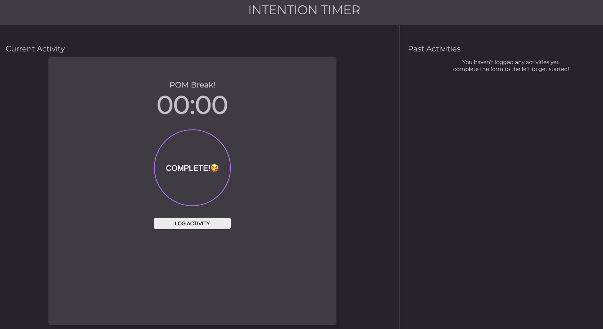

## Overview
Intention Timer is an application which allows users to track and manage activities. `Study`, `Meditate`, and `Exercise` are three categories a user may choose to help organize their goals. User can input a desired length of time and use the built in countdown timer to do the work for them! User can leave the application and return without losing their previous logged activities.

[View Deployed Page Here!](https://rachaelcarroll.github.io/intention-timer/)

## Functionality
-   When user visits [Intention Timer](https://rachaelcarroll.github.io/intention-timer/) they will see a new activity form on the left where they can select a category, type a description, and select minutes and seconds. The right shows a past activity section displaying text that they do not have any saved activities.

- When the form is completed and they click `Start Activity`, a countdown timer will display their inputed time. They will also see their displayed goal above.

- When countdown is complete, they will see a congratulatory message appear and `Log Activity`.  Once clicked, their completed activity is displayed on the Past Activity section and is saved to `local storage`.

-   From here user may click `Create A New Activity` and start the process over!  The previous completed activities will be visible on the Past Activity section and will remain on window reload.  

### Contributors
The HTML, CSS, and Javascript for Intention Timer was written by [Rachael Carroll](https://github.com/rachaelcarroll), [Sydney Bear](https://github.com/sydnerd), and [Fara Akhatova](https://github.com/Fakhatova), frontend engineering students at [Turing School of Software & Design](https://turing.edu/).

### Languages
* HTML
* CSS
* JavaScript

### Technical Goals
* Wireframing
* Writing semantic HTML
* Implementing foundational CSS
* Writing and refactoring clean JavaScript
* Updating the data model and the DOM
* Utilizing event listeners to respond to user events
* Utilizing localStorage to save data that user input

### Online Resources
* Git and Github: Project management and workflow
* MDN docs & Stack Overflow: Online resources
